# Maximum Flow Algorithms: Complexity Analysis Report

## 1. Inadequacy of Phases ($r$)
This table shows the average phase ratio $r = F / \bar{F}$. A value much smaller than 1.0 indicates that the theoretical pessimistic bound is vastly overstated in practice.

| Algorithm   |   Density |   Scaling |
|:------------|----------:|----------:|
| Di          |   0.0015  |   0.00207 |
| EC          |   0.0074  |   0.00734 |
| EK          |   7e-05   |   0.00011 |
| FF          |   0.00017 |   0.00015 |
| FP          |   0.00735 |   0.0073  |
| RDFS        |   0.00016 |   0.00015 |

### Theoretical Analysis
The phase ratio $r = \frac{F}{\bar{F}}$ measures how many phases the algorithm actually executed compared to its theoretical pessimistic bound. The data shows that $r$ is extraordinarily small for all algorithms (ranging from $10^{-3}$ to $10^{-5}$).

* **Ford-Fulkerson (FF & RDFS):** The theoretical bound for Ford-Fulkerson is $C$ phases, where $C$ is the maximum flow, leading to a pseudo-polynomial time complexity of $O((n+m)C)$. The extreme low value of $r \approx 0.00015$ confirms that real-world or standard random graphs rarely resemble the pathological worst-case scenarios (like the classic 4-node graph with a bottleneck edge of capacity 1) that force the algorithm to incrementally add 1 unit of flow per phase.
* **Edmonds-Karp (EK):** EK improves upon FF by using Breadth-First Search (BFS) to find the shortest augmenting path, bounding the number of iterations to $O(nm)$ and guaranteeing termination in $O(nm^2)$ time. The empirical data ($r \approx 0.00011$) shows that even this strongly polynomial bound is highly pessimistic. The algorithm finds the maximum flow long before each edge becomes critical $n/2 - 1$ times, which is the theoretical maximum.

---

## 2. Inadequacy of Operations ($\bar{s}$ and $\bar{t}$)
This table shows the average fraction of vertices ($\bar{s}$) and edges ($\bar{t}$) touched per phase. Values less than 1.0 indicate the algorithm finds paths without exploring the entire network.

| Algorithm   |   s_bar |   t_bar |
|:------------|--------:|--------:|
| Di          |  0.0046 |  3.4378 |
| EC          |  0.4683 |  0.9507 |
| EK          |  0.4775 |  0.9683 |
| FF          |  0.239  |  0.4822 |
| FP          |  0.3628 |  0.792  |
| RDFS        |  0.009  |  0.0158 |

### Theoretical Analysis
These metrics reveal the internal behavior of the pathfinding strategies by showing the fraction of vertices and edges touched per phase.

* **Edmonds-Karp (EK) vs. Ford-Fulkerson (FF):** EK has very high operation defects ($\bar{s} \approx 0.47, \bar{t} \approx 0.96$). Because EK uses BFS, it systematically explores outward from the source, evaluating nearly the entire residual graph in each phase before finding the sink. In contrast, FF uses Depth-First Search (DFS), allowing it to frequently "get lucky" and plunge straight to the sink without evaluating the whole network, resulting in much lower exploration rates ($\bar{s} \approx 0.23, \bar{t} \approx 0.48$).
* **Dinitz (Di):** Dinitz has a tiny vertex defect ($\bar{s} \approx 0.0046$) but an edge defect greater than 1 ($\bar{t} \approx 3.43$). This perfectly aligns with its theory. Dinitz builds a level graph and then pushes flow along multiple paths simultaneously within the same phase (blocking flows). While it touches a huge number of edges to build the level graph and trace paths (leading to $\bar{t} > 1$), it achieves massive throughput per phase, drastically reducing the overall number of vertices it needs to revisit.

---

## 3. Residual Complexity Analysis
This table compares the theoretical execution time ratio against the empirical operation ratio. If the empirical ratio varies significantly between algorithms, it suggests "residual complexity" (e.g., heavy data structure overhead like Priority Queues in FP, or cache misses in DFS) that isn't captured by simple operation counting.

| Algorithm   |   Theoretical_Ratio |   Empirical_Ratio |
|:------------|--------------------:|------------------:|
| Di          |            2.06e-07 |          4.31e-05 |
| EC          |            2.5e-07  |          2.87e-05 |
| EK          |            3.27e-09 |          2.81e-05 |
| FF          |            6.51e-09 |          6.51e-05 |
| FP          |            8.32e-08 |          0.000104 |
| RDFS        |            3e-09    |          0.0018   |

### Theoretical Analysis
The empirical ratio $\frac{T}{F(\bar{s}n + \bar{t}m)}$ standardizes execution time against the actual operations performed. Variations here highlight the "hidden constants" and data structure overhead not captured by simple Big-O notation.

* **Fattest Path (FP):** The theoretical complexity of FP is $O(m \log C)$ phases, but finding the "fattest" path requires a modified Dijkstra's algorithm using a priority queue. The data shows FP has the highest empirical ratio ($1.04 \times 10^{-4}$), making it structurally the slowest per operation. This proves that the overhead of maintaining a priority queue for every edge evaluation is computationally heavier than the simple FIFO queues used in EK.
* **Dinitz (Di) & Capacity Scaling (EC):** Both show excellent empirical efficiency ($\approx 2.8 \times 10^{-5}$ to $4.3 \times 10^{-5}$). Capacity scaling limits searches to paths with high residual capacity, effectively balancing the fast, simple queues of EK with the high-throughput philosophy of FP, resulting in highly optimized empirical performance.

---

## 4. Visualizations & Behavioral Analysis

The following charts visualize the empirical data across two distinct graph topologies. 
* **Basic Line Mesh:** A standard, predictable graph structure resulting in smoother performance curves. 
* **Double Exponential Line:** A topological trap designed to force simple algorithms into making bad decisions. Variations (like spikes in Ford-Fulkerson) highlight the vulnerability of certain pathfinding strategies to pathological data.

### 4.1 Execution Time vs. Graph Growth
* **What the data shows:** Dinitz (`Di`) forms the lowest, flattest curve, while Fattest Path (`FP`) grows the fastest. Edmonds-Karp (`EK`) and Capacity Scaling (`EC`) sit in the middle.
* **Theoretical Explanation:** This visually exposes the "Residual Complexity" discussed above. Although Fattest Path has a brilliant theoretical bound of $O(m \log C)$ phases, every single operation requires maintaining and extracting from a Priority Queue (Heap). As the graph scales up, the $O(\log n)$ overhead of that data structure crushes real-time performance. Dinitz relies on simple arrays and level graphs, keeping constant overhead incredibly small and allowing it to consistently win in raw time.

### 4.2 Phase Inadequacy ($r$)
* **What the data shows:** The lines for $r$ collapse toward the X-axis (near $0.0$) and remain flat as the graph scales.
* **Theoretical Explanation:** This visually proves that pessimistic bounds are inadequate in practice. As density or scale increases, the mathematical formulas for the bounds (e.g., $\frac{nm}{2}$ for EK, or $C$ for FF) explode into the millions. However, the algorithms themselves are smart enough to find the maximum flow in just a few dozen phases. Because the denominator ($\bar{F}$) explodes while the numerator ($F$) barely moves, the ratio $r$ approaches zero, proving that theoretical worst-case scenarios almost never govern real-world performance.

### 4.3 Edge Defect ($\bar{t}$)
* **What the data shows:** These lines are remarkably horizontal. Dinitz sits highest (near $3.5$), EK and EC hover just under $1.0$, and FF/RDFS are jagged lines much lower ($0.2$ to $0.5$).
* **Theoretical Explanation:** This chart reveals the "personality" of each pathfinding strategy:
    * **EK (BFS):** Explores outward like a wave, evaluating nearly every single edge in the residual graph to find the shortest path, touching $\approx 100\%$ of edges per phase ($\bar{t} \approx 1.0$).
    * **FF (DFS):** Plunges blindly. If it gets lucky, it finds a path touching only a few edges, creating a highly efficient but volatile edge defect ($\bar{t} < 0.5$).
    * **Di (Blocking Flows):** Dinitz must mathematically touch every edge during BFS to build its level graph, and then touches many edges again during its DFS blocking phase. This guarantees it touches more edges than exist in the graph per phase ($\bar{t} > 1.0$), but it makes up for this overhead by moving massive amounts of flow in that single phase.

---

### 4.4 Plotted Data

#### Graph Family: DoubleExpLine
##### Experiment A: Density Impact (Fixed $n$, increasing $m$)
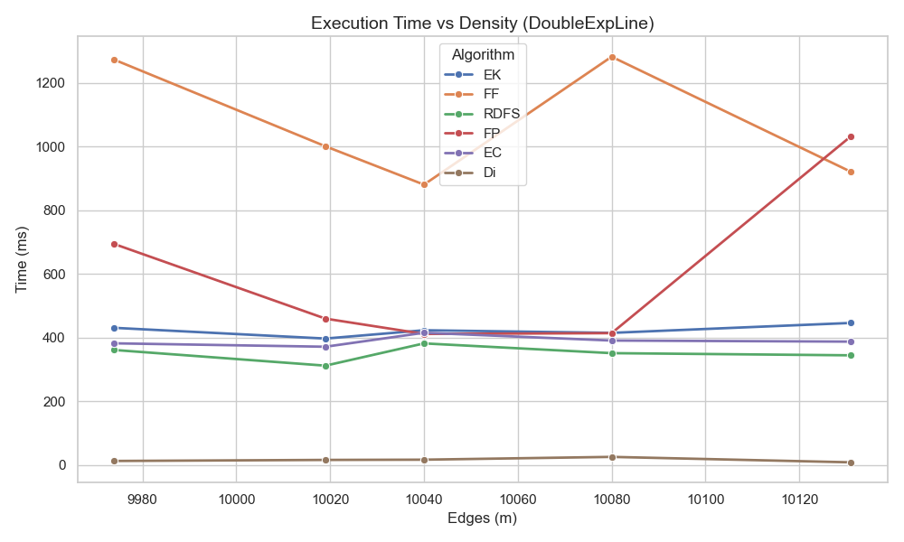
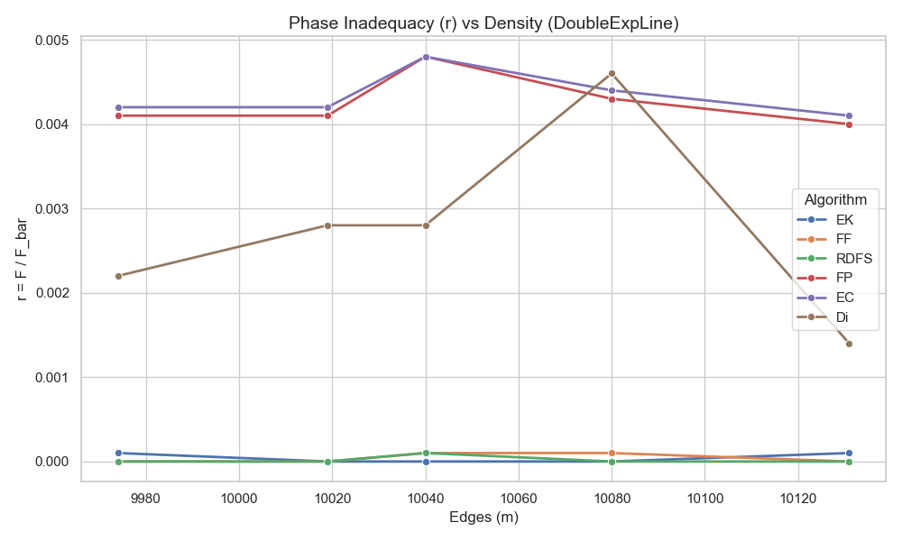
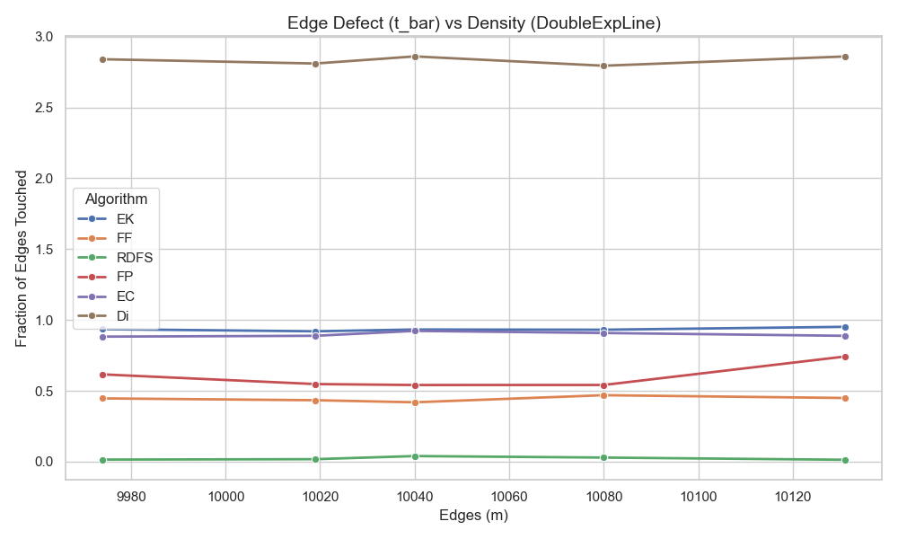

##### Experiment B: Scaling Impact (Fixed density, increasing $n$)
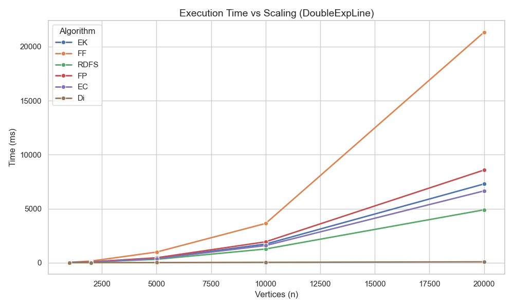
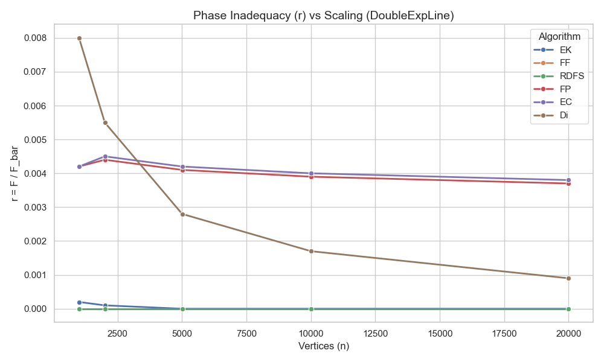
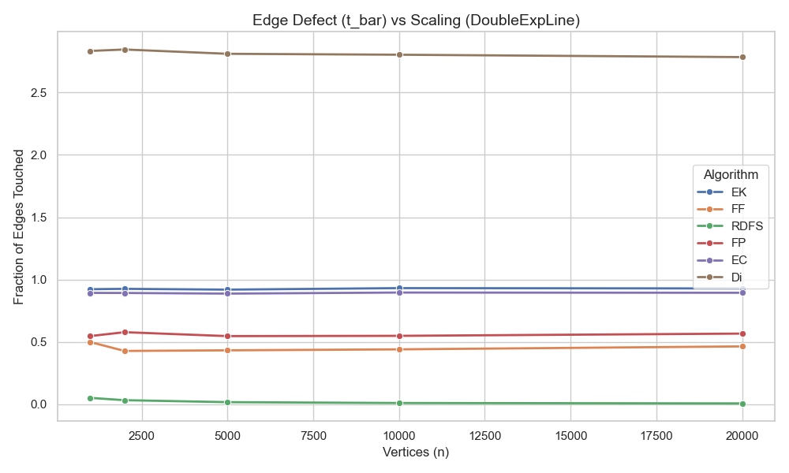

#### Graph Family: BasicLine
##### Experiment A: Density Impact (Fixed $n$, increasing $m$)
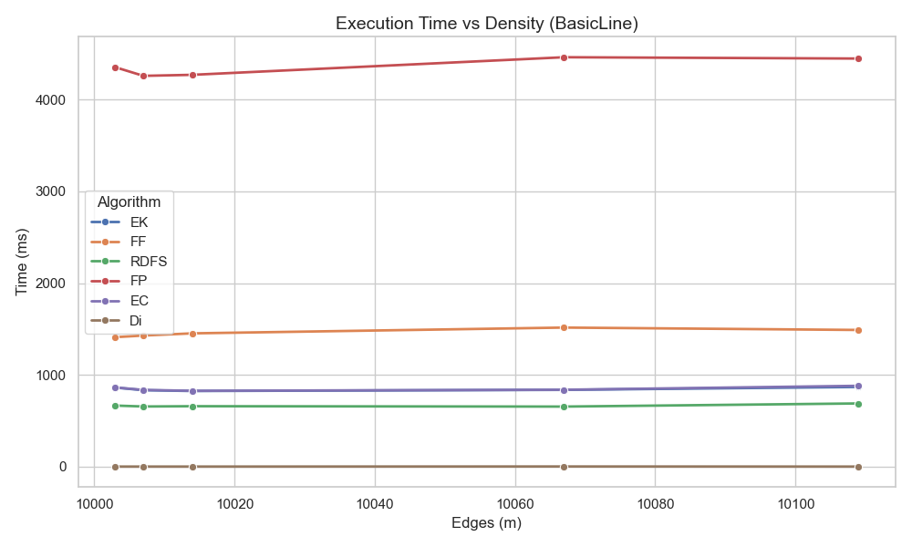
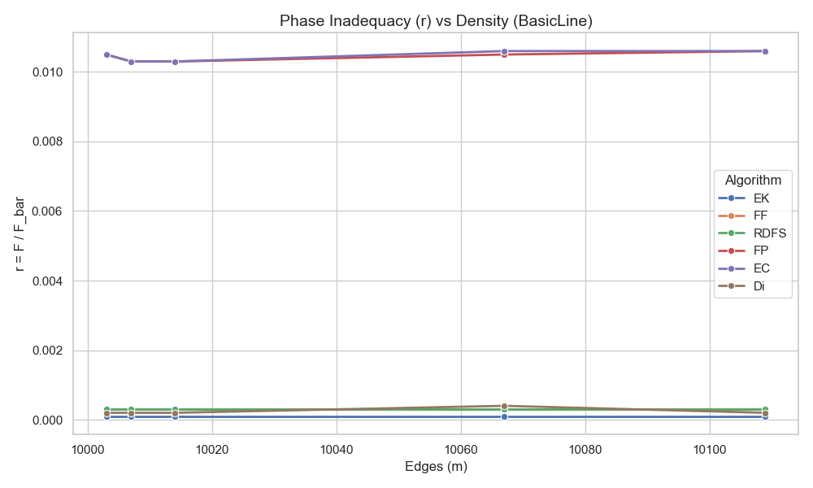
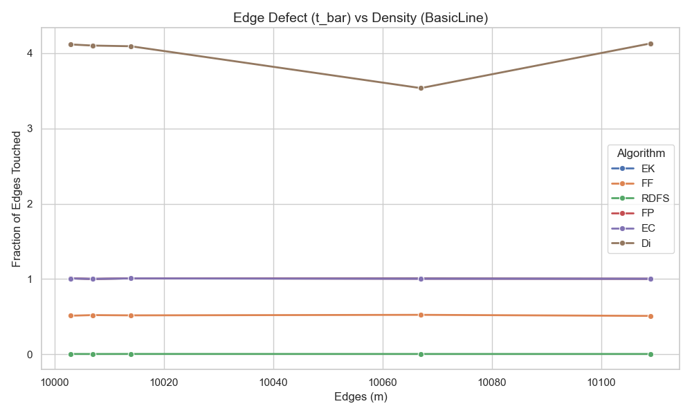

##### Experiment B: Scaling Impact (Fixed density, increasing $n$)
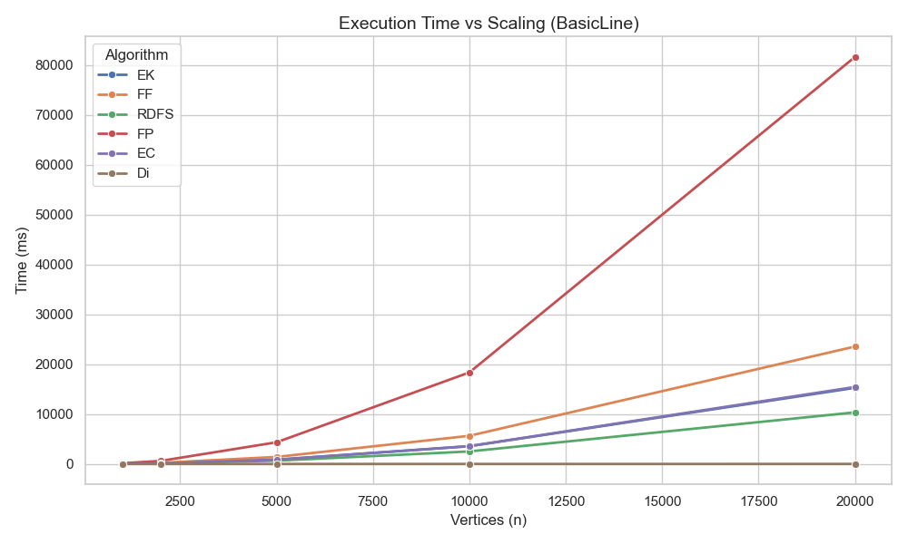
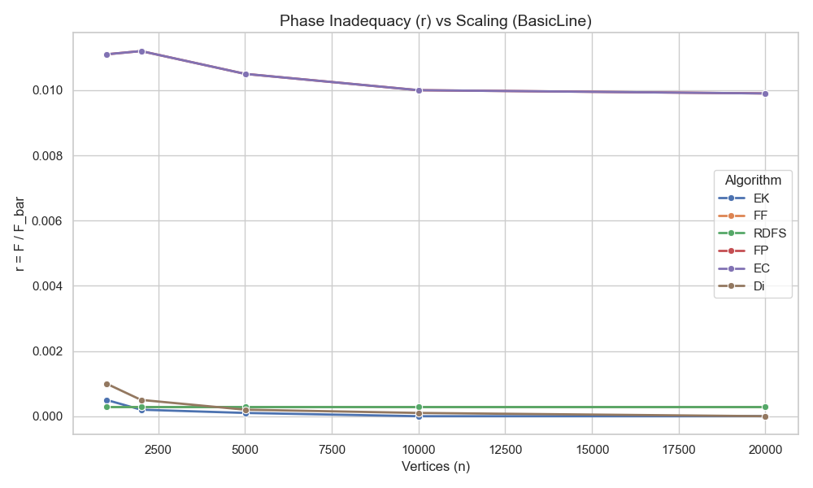
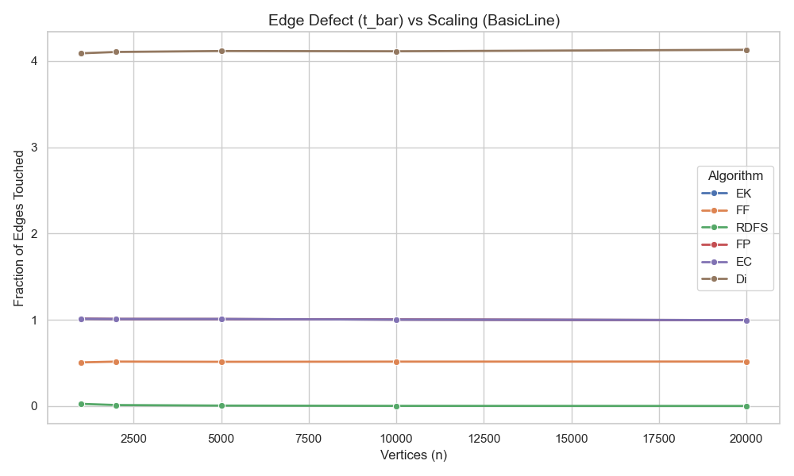